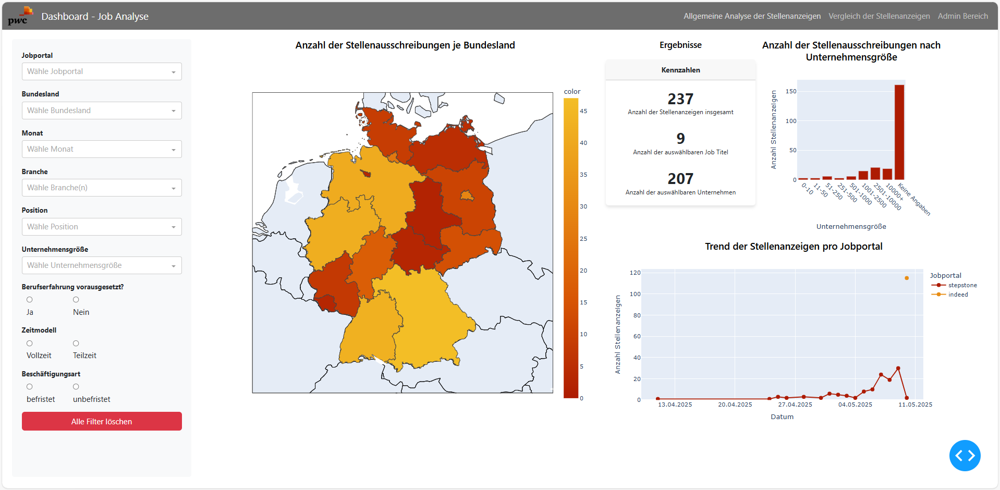

Usage Instructions
==================

Starting the Dashboard
-----------------------

The dashboard can be launched either by running the main application file (:code:`main.py`) directly or within a Docker container setup. Both methods will start the local server and open the dashboard in your default browser. Detailed explanations of the Python files and their structure will follow in the :doc:`modules` section of this documentation.

Dashboard Features
-------------------

The dashboard consists of three main sections, each accessible via the top navigation bar and labeled in German:

1. **"Allgemeine Analyse der Stellenanzeigen"**
   This section provides an overview of the collected job advertisements. It includes key figures such as the total number of postings, the number of distinct job titles and companies, as well as dynamic bar and line charts. Users can explore job trends across different company sizes and job portals over time.

2. **"Vergleich der Stellenanzeigen"**
   This section offers a side-by-side comparison of compensation and benefits — a core focus of our collaboration with PwC. Users can select two companies and job titles to compare compensation structures, benefits, and other job-related KPIs. The layout displays mirrored charts to easily identify differences between the selected entities. To enhance clarity, compensation and benefits are organized into three categories: financial compensation ("Finanzielle Vergütung"), workplace environment ("Arbeitsumfeld"), and additional benefits ("Zusatzleistungen"). A dynamic legend allows for interactive filtering, and all comparisons are presented within a single integrated dashboard to ensure a consistent and accessible overview.

3. **"Admin Bereich"**
   This password-protected area in the navigation bar allows authorized users to manage the list of job titles that feed into the data scraping process. Users can upload a new job-titles file, view the current list, or clear the existing entries. The admin section also includes confirmation prompts and success messages for feedback.

**Note on Filter Functionality:**
The filters located on the left side of the dashboard function as global filters that apply primarily to the first two sections. These filters remain active and synchronized when users navigate between these sections, ensuring that data is consistently filtered across different views. This design supports a unified and coherent analysis process, allowing users to compare data sets under the same filtering criteria without the need to reapply filters manually. The global filters can be reset at any time using a dedicated reset button, providing flexibility while maintaining consistency. In the Admin Bereich, these filters are intentionally hidden, as they are not relevant to administrative tasks.

Screenshots
------------

The following images provide a visual impression of each dashboard section as described above, showing the dashboard layout and functionality using the color scheme provided by PwC.

.. image:: _static/comparison-screenshot.png
   :width: 800
   :alt: Compensation and benefits comparison view

.. image:: _static/admin-screenshot.png
   :width: 800
   :alt: Admin area for managing job title lists
